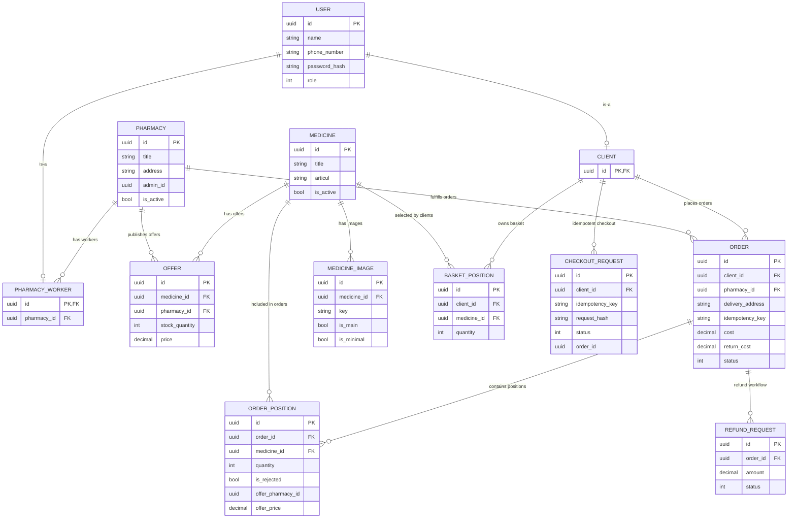

# Domain Entities (Mermaid)

```mermaid
erDiagram
    USER ||--o| CLIENT : "is-a"
    USER ||--o| PHARMACY_WORKER : "is-a"

    PHARMACY ||--o{ PHARMACY_WORKER : "has workers"
    PHARMACY ||--o{ OFFER : "publishes offers"
    PHARMACY ||--o{ ORDER : "fulfills orders"

    MEDICINE ||--o{ MEDICINE_IMAGE : "has images"
    MEDICINE ||--o{ OFFER : "has offers"
    MEDICINE ||--o{ BASKET_POSITION : "selected by clients"
    MEDICINE ||--o{ ORDER_POSITION : "included in orders"

    CLIENT ||--o{ BASKET_POSITION : "owns basket"
    CLIENT ||--o{ ORDER : "places orders"
    CLIENT ||--o{ CHECKOUT_REQUEST : "idempotent checkout"

    ORDER ||--o{ ORDER_POSITION : "contains positions"
    ORDER ||--o{ REFUND_REQUEST : "refund workflow"

    USER {
      uuid id PK
      string name
      string phone_number
      string password_hash
      int role
    }

    CLIENT {
      uuid id PK,FK
    }

    PHARMACY_WORKER {
      uuid id PK,FK
      uuid pharmacy_id FK
    }

    PHARMACY {
      uuid id PK
      string title
      string address
      uuid admin_id
      bool is_active
    }

    MEDICINE {
      uuid id PK
      string title
      string articul
      bool is_active
    }

    MEDICINE_IMAGE {
      uuid id PK
      uuid medicine_id FK
      string key
      bool is_main
      bool is_minimal
    }

    OFFER {
      uuid id PK
      uuid medicine_id FK
      uuid pharmacy_id FK
      int stock_quantity
      decimal price
    }

    BASKET_POSITION {
      uuid id PK
      uuid client_id FK
      uuid medicine_id FK
      int quantity
    }

    ORDER {
      uuid id PK
      uuid client_id FK
      uuid pharmacy_id FK
      string delivery_address
      string idempotency_key
      decimal cost
      decimal return_cost
      int status
    }

    ORDER_POSITION {
      uuid id PK
      uuid order_id FK
      uuid medicine_id FK
      int quantity
      bool is_rejected
      uuid offer_pharmacy_id
      decimal offer_price
    }

    CHECKOUT_REQUEST {
      uuid id PK
      uuid client_id FK
      string idempotency_key
      string request_hash
      int status
      uuid order_id
    }

    REFUND_REQUEST {
      uuid id PK
      uuid order_id FK
      decimal amount
      int status
    }
```
